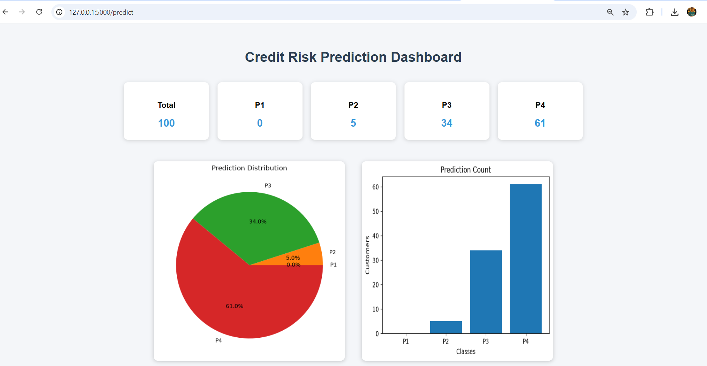
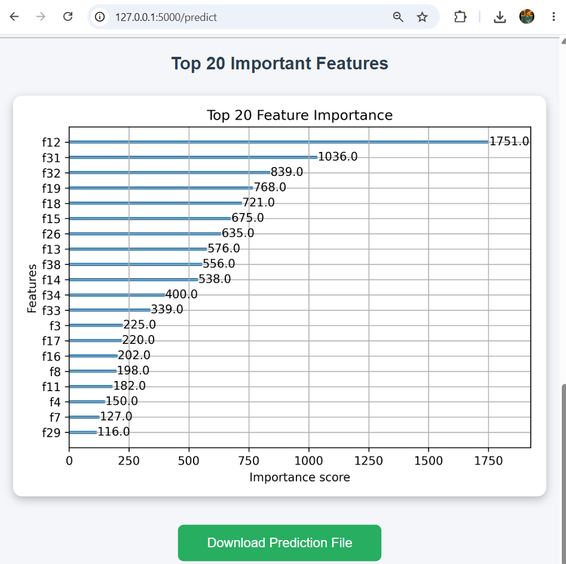

## Project Structure

```text
Credit_Risk_Modelling/

├── models/
│   ├── education_encoder.pkl
│   ├── preprocessor.pkl
│   ├── label_encoder.pkl
│   └── xgb_model.json
│
├── notebook/
│   └── Credit_Risk_Modelling.ipynb
│
├── sample_files/
│   ├── Test_Dataset_100_Rows.xlsx
│   └── Final_Predictions.xlsx
│
├── screenshots/
│   ├── home_page.png
│   ├── prediction_result.png
│   ├── dashboard.png
│   └── feature_importance.png
│
├── templates/
│   ├── index.html
│   └── dashboard.html
│
├── app.py
├── requirements.txt
└── README.md
```

## Prediction Classes

- P1 – Lowest Credit Risk
- P2 – Low Credit Risk
- P3 – Medium Credit Risk
- P4 – High Credit Risk

## Dashboard Preview

The Flask dashboard provides an interactive summary of credit risk predictions, including:

- Prediction Summary (P1–P4)
- Pie Chart of Prediction Distribution
- Bar Chart of Prediction Counts
- Download Prediction Report



---

## Feature Importance

The XGBoost model's top 20 most influential features are visualized to improve model interpretability.

