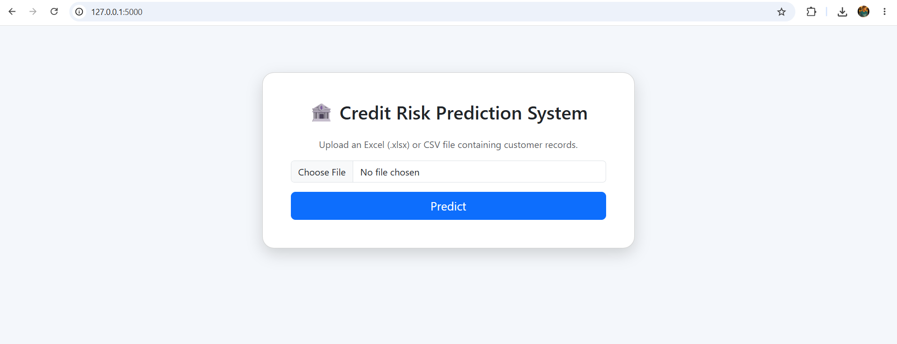
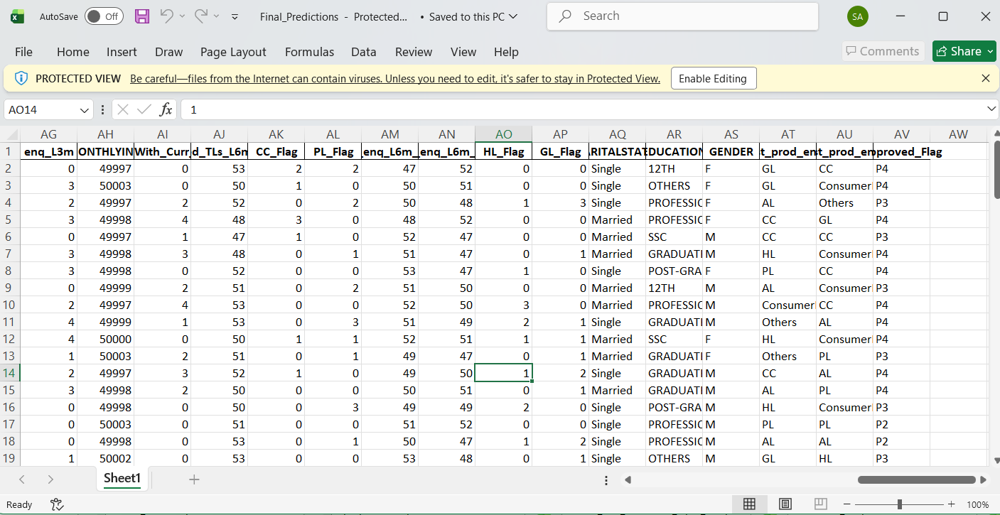

# Credit Risk Prediction using XGBoost

## Project Overview

This project is a Machine Learning based Credit Risk Prediction System developed using Python, Scikit-learn, XGBoost and Flask.

The application predicts the credit approval category of customers based on their financial and credit history.

---

## Features

- Upload CSV or Excel files
- Automatic preprocessing
- Custom feature encoding
- XGBoost based prediction
- Download predictions as Excel
- Flask based web interface

---

## Tech Stack

- Python
- Flask
- Pandas
- NumPy
- Scikit-learn
- XGBoost
- Joblib
- OpenPyXL

---

## Machine Learning Workflow

- Data Cleaning
- Feature Engineering
- ANOVA Feature Selection
- Chi-Square Test
- VIF Analysis
- Standard Scaling
- XGBoost Classifier

---

## Project Structure

```
## Project Structure

```text
Credit_Risk_Modelling/

├── models/
│   ├── education_encoder.pkl
│   ├── preprocessor.pkl
│   ├── label_encoder.pkl
│   └── xgb_model.json
│
├── notebook/
│   └── Credit_Risk_Modelling.ipynb
│
├── sample_files/
│   ├── Test_Dataset_100_Rows.xlsx
│   └── Final_Predictions.xlsx
│
├── screenshots/
│   ├── home_page.png
│   └── Prediction_Output.png
│
├── templates/
│   └── index.html
│
├── app.py
├── requirements.txt
└── README.md
```
```

---

## Run Locally

```bash
pip install -r requirements.txt

python app.py
```

---

## Flask Web Application

### Home Page



---


### Prediction Output

